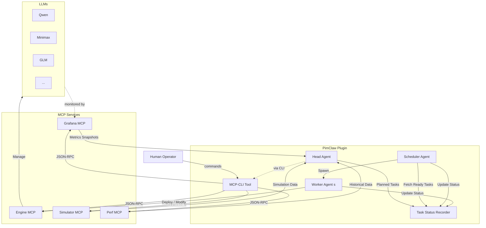

# PimClaw Architecture Design

PimClaw is a multi-agent orchestration plugin that monitors LLM runtime metrics, autonomously detects performance anomalies, and schedules corrective deployment tasks through a pipeline of specialized agents connected via MCP services.

---

## 1. Glossary

| Term | Definition |
|------|------------|
| **TTFT** | Time To First Token (ms) — latency before first token is generated |
| **TPOT** | Time Per Output Token (ms) — per-token generation latency |
| **QPS** | Queries Per Second — request-level throughput |
| **Throughput** | Tokens per second — token-level throughput |
| **TP** | Tensor Parallelism — splitting model layers across multiple GPUs to reduce latency |
| **PP** | Pipeline Parallelism — splitting model stages across GPU groups to fit larger models |
| **DP** | Data Parallelism — running multiple model replicas to scale throughput |
| **MCP** | Model Context Protocol — an open standard for tool/agent interoperability |
| **OpenClaw** | The host agent framework (TypeScript/Node.js) providing multi-channel AI assistant infrastructure |
| **Snapshot** | A point-in-time capture of LLM runtime metrics from Grafana (covering the last 5 minutes) |
| **MCP-CLI** | A command-line tool that acts as a shell-to-MCP bridge, enabling both humans and agents to interact with MCP servers via terminal commands |

---

## 2. System Overview

PimClaw is an OpenClaw plugin that integrates:

- **Multiple LLM engines** (Qwen, Minimax, GLM, etc.) — the deployed AI models being managed.
- **Four MCP services** (Grafana, Engine, Simulator, Performance) — external capabilities exposed via MCP.
- **A central task orchestration pipeline** — coordinated by four agent types.
- **Human operator access** — via OpenClaw's chat channels (CLI, Web UI, WhatsApp, Telegram, etc.) for querying system status, reviewing decisions, and manual overrides.

### Architectural Principles

- **MCP-only access**: PimClaw does NOT directly access databases, Kubernetes, or any infrastructure. All external interactions are mediated through MCP services, making PimClaw a pure orchestration and intelligence layer.
- **Agent failure isolation**: Individual agent failures are isolated and do not cascade to other agents.
- **Portability**: Core agent logic is decoupled from OpenClaw. All capabilities are also exposed via a standalone MCP server for consumption by other frameworks (CrewAI, LangGraph, AutoGen, etc.).
- **Dual MCP transport**: Agents can interact with external MCP services via the standard MCP SDK client (in-process, structured JSON-RPC) or via MCP-CLI (shell commands with on-demand discovery and Unix piping). The choice is per-call, enabling agents to optimize for context efficiency.

---

## 2. Agents

### Head Agent (Decision Engine)

The intelligence center of PimClaw. It operates in an **Observe–Think–Decide** loop.

- **MCP Skills**: Grafana, Perf, Simulator
- **Cognitive Skills**: Searching, Data Analyzing, Thinking, Deciding
- **Consumes**: Grafana metric snapshots, Perf historical data, Simulator projections
- **Produces**: Events, decisions, and planned tasks
- **Behavior**: Periodically collects a 5-min metrics snapshot, analyzes for anomalies (e.g., TTFT/TPOT spikes or drops), searches for supporting data from Perf and Simulator services, then decides whether to plan corrective tasks.

### Task Status Recorder Agent

Central task state manager. All other agents interact with it to read and update task state.

- **Stores**: Tasks and their statuses
- **Manages**: Task lifecycle transitions, expiry enforcement
- **Exposes**: An internal API for Scheduler and Workers to query and update tasks

### Scheduler Agent

Bridges the gap between planned tasks and execution.

- **Fetches**: Ready tasks from the Task Status Recorder
- **Creates**: Ephemeral one-time Worker Agents (each with Engine MCP skill)
- **Dispatches**: Tasks to Workers
- **Concurrency Limit**: Max 10 active Workers at a time (configurable); stops fetching when at capacity
- **Enforces**: Scheduling timeouts and task expiry

### Worker Agents

The execution layer. Created on-demand, one per task, disposed after completion.

- **MCP Skills**: Engine (for viewing, creating, and changing LLM deployments)
- **Executes**: A single task
- **Reports**: Status updates back to the Task Status Recorder

---

## 3. MCP Services Layer

| Service | Provides | Interacts With |
|---------|----------|----------------|
| **Grafana MCP** | Real-time observability metrics for deployed LLMs | Head Agent |
| **Engine MCP** | Interfaces for viewing, creating, and modifying LLM deployments | Worker Agents |
| **Simulator MCP** | Simulated performance data for a given deployment configuration | Head Agent |
| **Perf MCP** | Historical test performance data for a given deployment configuration | Head Agent |

### Transport Modes

Agents can talk to external MCP services via two transport modes:

| Mode | Mechanism | Best For |
|------|-----------|----------|
| **MCP SDK Client** | In-process `@modelcontextprotocol/sdk` client, stdio JSON-RPC | Standard tool calls where the agent needs the full structured response in context |
| **MCP-CLI** | Shell command (`pimclaw mcp call <server> <tool> [args]`) | On-demand discovery (avoid loading all tool schemas upfront), piping results through `jq`/`grep`/`awk` to extract only what matters, keeping context lean |

Both modes connect to the same MCP servers — the CLI wraps the SDK client. The agent decides per-call which mode to use.

---

## 4. LLM Layer

The deployed AI models managed by PimClaw:

- Qwen, Minimax, GLM, and more (extensible)
- Monitored by the Grafana service
- Deployments managed via the Engine MCP service

---

## 5. Agent Lifecycle Management

### Startup Sequence

Agents are started in dependency order. If any agent fails to reach "Listening" within its timeout, the startup is aborted and all previously started agents are shut down.

#### 1. Task Status Recorder Agent

1. Set status to `Starting`.
2. Load persisted tasks and statuses from local storage.
3. Scan all tasks: if a task's status is `ready` and its create time + 1 min < now, mark it as `expired`.
4. Scan all tasks: if a task's status is `scheduling` and its status modified time + 30s < now, mark it as `expired`.
5. Set status to `Listening`.
6. If not `Listening` within 1 minute, startup fails.

#### 2. Scheduler Agent

1. Set status to `Starting`.
2. Initialize the active Workers tracker (empty set).
3. Verify connectivity to the Task Status Recorder Agent (must be `Listening`).
4. Reconcile: query the Task Status Recorder for any tasks in `scheduling` or `scheduled` status that were owned by this Scheduler in a previous run — mark them as `expired` or reset to `ready` based on retry policy.
5. Set status to `Listening`.
6. Begin the polling loop: fetch up to (max concurrency − active Workers) `ready` tasks per cycle.

#### 3. Head Agent

1. Set status to `Starting`.
2. Verify connectivity to the Task Status Recorder Agent (must be `Listening`).
3. Verify connectivity to Grafana, Simulator, and Perf MCP services.
4. Load persisted snapshot–events–tasks combinations from local storage (sliding window of last N copies, default 5).
5. Check for any snapshot that has no corresponding events/tasks (unprocessed) and is still fresh (snapshot create time + 1 min > now) — re-analyze and decide on those snapshots. Note: this is a **snapshot staleness check** for re-analysis, not a task expiry check. A snapshot older than 1 minute is considered stale because its metrics no longer reflect current system state, so re-analyzing it would produce unreliable decisions. Task expiry (Section 7) is a separate concept governed by the Task Status Recorder.
6. Discard any stale unprocessed snapshots (older than 1 min) without re-analysis.
7. Set status to `Listening`.
8. Begin the observe–think–decide loop (collect metrics every 5 minutes).

#### 4. Worker Agents

- Not started during the startup sequence.
- Spawned dynamically by the Scheduler, one per task.
- On creation: set status to `Starting`, verify connectivity to Engine MCP, set status to `Listening`, execute the assigned task.

### Shutdown Sequence

1. Signal Head Agent to stop (stops producing new tasks).
2. Signal Scheduler Agent to stop (stops fetching new tasks; waits for in-flight Workers to finish or timeout).
3. Signal Task Status Recorder Agent to stop (persists all in-flight task state).
4. All agents persist their state for recovery on next startup.

### Agent Statuses

`Starting` → `Listening` → `Stopping` → `Stopped`

### Agent Runtime Status

Each live agent continuously reports its runtime status to a central **Agent Registry** within the PimClaw plugin. This registry is queryable via the MCP server, MCP-CLI, and OpenClaw's chat channels.

#### Runtime Status Fields

| Field | Type | Description |
|-------|------|-------------|
| `agentId` | string | Unique agent identifier |
| `agentType` | enum | `head`, `scheduler`, `recorder`, `worker` |
| `status` | enum | `Starting`, `Listening`, `Stopping`, `Stopped` |
| `startedAt` | timestamp | When the agent entered `Starting` |
| `listeningAt` | timestamp? | When the agent entered `Listening` (null if not yet) |
| `uptime` | duration | Time since `Listening` |
| `lastActivityAt` | timestamp | Last time the agent performed a meaningful action |
| `currentAction` | string? | What the agent is currently doing (e.g., "analyzing snapshot", "executing task T-42") |
| `mcpConnections` | object[] | Status of each MCP service connection (`connected`, `disconnected`, `error`) |
| `counters` | object | Agent-type-specific counters (see below) |
| `errors` | object | `errorCount`, `lastError`, `lastErrorAt` |

#### Agent-Type-Specific Counters

| Agent Type | Counter Fields |
|------------|----------------|
| **Head** | `snapshotsCollected`, `eventsDetected`, `tasksPlanned`, `snapshotsSkipped` (due to full capacity) |
| **Recorder** | `totalTasks`, `readyTasks`, `runningTasks`, `doneTasks`, `failedTasks`, `expiredTasks` |
| **Scheduler** | `activeWorkers`, `maxWorkers`, `tasksScheduled`, `tasksExpiredByScheduler`, `tasksRescheduled` |
| **Worker** | `taskId`, `taskStatus`, `progress` (if reportable), `startedAt` |

#### Exposure

The runtime status is exposed through three channels:

| Channel | Method |
|---------|--------|
| **MCP Server** | `pimclaw_agents_status` tool — returns the full registry as structured JSON |
| **MCP-CLI** | `pimclaw agents list` and `pimclaw agents status <agentId>` |
| **OpenClaw Chat** | Operator asks "What's the status of PimClaw?" — routed to the status tool, rendered as a readable summary |

---

## 6. Task State Machine

```
ready → scheduling → scheduled → running → done
  │         │                       │
  └→expired └→expired              └→failed
```

| Status | Meaning |
|--------|---------|
| `ready` | Task is queued and available for scheduling |
| `scheduling` | Scheduler has claimed the task, creating a Worker |
| `scheduled` | Worker has been created and assigned the task |
| `running` | Worker is actively executing the task |
| `done` | Task completed successfully |
| `failed` | Task execution failed |
| `expired` | Task timed out or was revoked |

---

## 7. Task Scheduling, Rescheduling & Revocation

### Scheduling

- Scheduler polls the Task Status Recorder for tasks with `ready` status.
- Scheduler evaluates tasks by: LLM deployment name, severity, status, create time, and status modified time.
- Updates status to `scheduling`, then spawns a Worker Agent.
- After Worker Agent is created, updates status to `scheduled`.

### Timeout & Expiry Rules

| Condition | Action |
|-----------|--------|
| Task is `ready` and created >1 min ago | Mark as `expired` |
| Task is `scheduling` and status unchanged for >30s | Mark as `expired` |
| Task is `running` and status unchanged for configured timeout | Mark as `failed` |

### Rescheduling

- If a task fails or times out, Scheduler can reset its status to `ready` (with a retry count and configurable max retries).
- Expired tasks are **not** rescheduled unless explicitly reset.

### Revocation

- Expired and failed tasks are marked as such and excluded from scheduling.
- Head Agent checks available capacity in the Task Status Recorder before submitting new tasks; if full, the event handling is skipped.

---

## 8. Data Flow

### Head Agent Loop (every 5 minutes)

1. Collect a metrics snapshot from Grafana MCP.
2. Analyze the snapshot: detect anomalies (e.g., TTFT/TPOT increase >200% or decrease <50% vs. prior window).
3. Search Web, Perf and Simulator MCP for supporting data.
4. Decide whether to plan tasks.
5. If yes, check capacity with Task Status Recorder, then submit planned tasks.
6. Save the snapshot–events–tasks combination locally (keep last N copies, default 5).

### Metric Interpretation Rules

The Head Agent uses these rules when analyzing snapshots and deciding on corrective tasks:

| Metric | Direction | Interactive (chat) Priority | Batch (summary) Priority |
|--------|-----------|----------------------------|-------------------------|
| TTFT | Lower is better | HIGH | Low |
| TPOT | Lower is better | HIGH | Medium |
| QPS | Higher is better | Medium | HIGH |
| Throughput | Higher is better | Medium | HIGH |
| GPU Memory Utilization | 0.90–0.96 optimal | Medium | Medium |

The Head Agent must consider the scenario type of each LLM deployment when weighing which metrics matter most.

### Task Execution Flow

1. Scheduler fetches `ready` tasks from Task Status Recorder.
2. Scheduler creates a Worker Agent and assigns the task.
3. Worker calls Engine MCP to execute the deployment change.
4. Worker reports `done` or `failed` back to Task Status Recorder.

---

## 9. Persistence & Recovery

- **Head Agent**: Persists the last N snapshot–events–tasks combinations locally. On restart, re-analyzes any unprocessed snapshots that are still fresh (< 1 min old). This staleness window is independent of task expiry — it reflects how quickly metrics data becomes irrelevant for decision-making.
- **Task Status Recorder**: Persists all tasks and statuses. On restart, expires any stale `ready` tasks.
- **Scheduler Agent**: Tracks active Worker count only (no local task copy). On restart, reconciles orphaned tasks with the Task Status Recorder.
- **Worker Agents**: Ephemeral — no persistence needed. If a Worker dies, the Scheduler detects the timeout and can reschedule.

---

## 10. Architecture Diagram



---

## 11. Key Design Principles

- **Observe–Think–Decide Loop**: The Head Agent forms a closed-loop control system over LLM deployments.
- **Clear Task State Transitions**: A well-defined state machine ensures every task is tracked and no work is lost.
- **MCP-Driven Integration**: All external capabilities are exposed as MCP services, giving agents a uniform interface.
- **Ephemeral Workers**: Created on-demand and disposed after completion, avoiding stale state.
- **Timeout & Expiry Enforcement**: Time-based guards at every stage prevent tasks from stalling indefinitely.
- **Ordered Agent Lifecycle**: Agents start in dependency order and shut down gracefully with state persistence.
- **Separation of Concerns**: Decision-making, task storage, scheduling, and execution are fully decoupled.

---

## 12. Security Constraints

- No direct database or Kubernetes access from any agent — all data via MCP services.
- No raw shell execution capabilities exposed to agents.
- MCP service credentials are passed via environment variables, never hardcoded.
- Tool policy pipeline controls which MCP tools are available in which agent contexts.

---

## 13. Constraints & Configuration

### Runtime Constraints

| Constraint | Value |
|------------|-------|
| Runtime | Node.js >= 22.16.0 |
| Language | TypeScript (ES modules) |
| Host framework | OpenClaw |
| MCP SDK | `@modelcontextprotocol/sdk` (client and server) |
| LLM provider | Managed by OpenClaw (provider-agnostic) |

### Configuration

MCP services are configured declaratively — new services can be connected without code changes:

```yaml
plugins:
  pimclaw:
    autoStart: true
    snapshotIntervalMinutes: 5
    snapshotStalenessMinutes: 1
    maxSnapshotCopies: 5
    maxConcurrentWorkers: 10
    taskExpirySeconds: 60
    schedulingTimeoutSeconds: 30
    grafanaMcp:
      command: "node"
      args: ["path/to/grafana-mcp-server.js"]
    engineMcp:
      command: "node"
      args: ["path/to/engine-mcp-server.js"]
    perfMcp:
      command: "node"
      args: ["path/to/perf-mcp-server.js"]
    simMcp:
      command: "python"
      args: ["path/to/sim-mcp-server.py"]
```

---

## 14. MCP-CLI Tool

A command-line interface that acts as a shell-to-MCP bridge. It serves both human operators and agents.

### Why

1. **On-demand discovery** — Instead of loading all tool definitions into the agent's context window upfront (potentially thousands of tokens), an agent fetches only the schema it needs right before calling it.
2. **Data filtering via Unix pipes** — Large MCP responses (e.g., a full metrics snapshot) can be piped through `jq`, `grep`, or `awk` before entering the agent's context, keeping it lean.
3. **Operator access** — Human operators can inspect MCP servers, test tool calls, manage agents, and manipulate tasks without the full AI pipeline.

### Commands

| Command | Description |
|---------|-------------|
| `pimclaw mcp list` | List all connected MCP servers and their status |
| `pimclaw mcp tools <server>` | List all tools exposed by a specific MCP server |
| `pimclaw mcp schema <server> <tool>` | Show the JSON Schema for a tool's parameters |
| `pimclaw mcp call <server> <tool> [args]` | Call a tool on an MCP server with JSON arguments |
| `pimclaw agents list` | List all agents with their current runtime status |
| `pimclaw agents status <agentId>` | Show detailed runtime status for a specific agent |
| `pimclaw agents start <agent>` | Start a specific agent |
| `pimclaw agents stop <agent>` | Stop a specific agent |
| `pimclaw agents restart <agent>` | Restart a specific agent |
| `pimclaw tasks list [--status=<status>]` | List tasks, optionally filtered by status |
| `pimclaw tasks inject <task-json>` | Manually inject a task into the Task Status Recorder |
| `pimclaw tasks retry <task-id>` | Reset a failed task to `ready` for rescheduling |
| `pimclaw tasks revoke <task-id>` | Mark a task as `expired` |
| `pimclaw health` | Show a system-wide health report |

### Agent Usage Example

A Head Agent can use MCP-CLI instead of (or alongside) the SDK client:

```bash
# Discover what tools Grafana offers (no schema loaded into context yet)
pimclaw mcp tools grafana

# Fetch only the schema for the tool it needs
pimclaw mcp schema grafana get_metrics

# Call the tool and pipe through jq to extract only TTFT and TPOT
pimclaw mcp call grafana get_metrics '{"window": "5m"}' | jq '{ttft: .ttft, tpot: .tpot}'

# Compare against historical data, extracting just the relevant fields
pimclaw mcp call perf query_benchmarks '{"model": "Qwen/Qwen3-32B"}' | jq '[.[] | {ttft, tpot, tp: .tensor_parallel_size}]'
```

This keeps bulky data out of the agent's conversation context and enables composable data pipelines.

### Architecture

The CLI connects to PimClaw's own MCP server — the same one exposed for framework portability. No separate API surface is needed.

```
Operator / Agent
       │
       ▼
┌─────────────┐
│  MCP-CLI    │  (pimclaw CLI binary)
│  Tool       │
└──────┬──────┘
       │ stdio / JSON-RPC
       ▼
┌─────────────┐
│  PimClaw    │  (MCP server exposing all tools)
│  MCP Server │
└──────┬──────┘
       │ dispatches to
       ▼
┌─────────────────────────┐
│  Agent Pipeline /       │
│  External MCP Services  │
└─────────────────────────┘
```